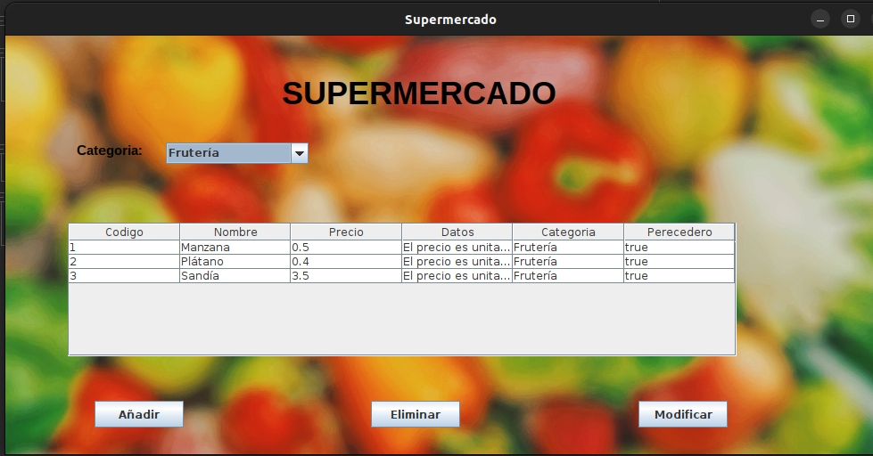
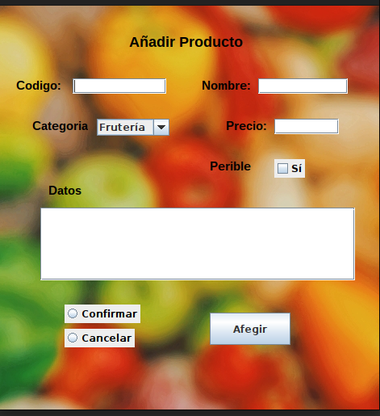
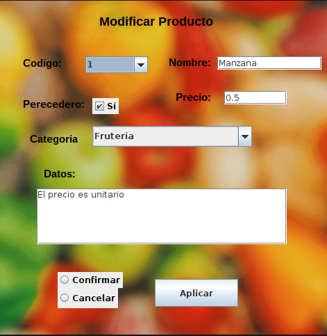
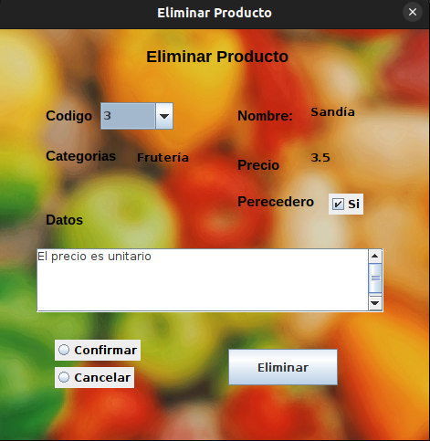

# 🛒 Supermarket Product Manager - Java MVC Project
A Java-based desktop application following the **Model-View-Controller (MVC)** architecture and **Object-Oriented Programming (OOP)** principles. The project simulates a supermarket product management system with filtering and CRUD functionalities.

## 📸 Screenshots

### Main View


### Add Product Form


### Edit Product Form


### Delete Product Form


## 🚀 Features
- **MVC Architecture** separating data, interface, and logic.
- **Object-Oriented Design** ensuring maintainability and scalability.
- **Product listing** with the ability to filter by supermarket sections.
- **CRUD operations:**
  - Add new products via a form window.
  - Edit existing products.
  - Delete unwanted products.
- **Interactive UI** for smooth user experience.

## 🛠️ Installation
Clone this repository and run the application:
```bash
 git clone https://github.com/YourGitHubUsername/SupermarketProductManager-Java.git
 cd SupermarketProductManager-Java
 javac -d bin src/*.java
 java -cp bin Main
```

## 🧠 How to Use
1. **Launch the application** to view the product list.
2. **Filter products** by selecting a supermarket section.
3. **Add new products** using the 'Añadir' button, which opens a new form window.
4. **Edit products** by selecting an item and clicking 'Editar'.
5. **Delete products** by selecting an item and clicking 'Eliminar'.

## 👨‍💻 Author
- **Your Name** — [GitHub](https://github.com/YourGitHubUsername)

Happy coding! 🚀

